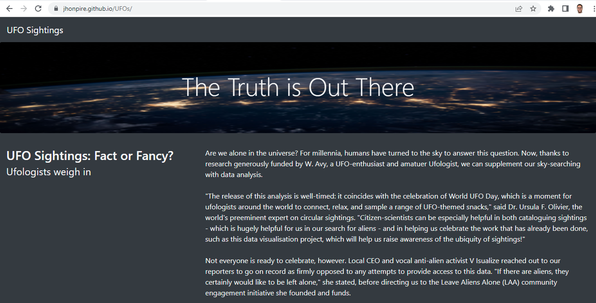
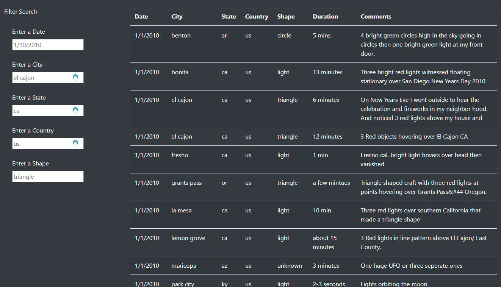

# UFOs
Creation of a website for Dana to post her writing and data about her home town Using a combination of Java, HTML and Bootstrap.

[Link to deployed Webpage](https://jhonpire.github.io/UFOs/)

# Project Overview

The purpose on this project is to create a website where our client can visualize her UFO sighting data stored in a JavaScript Array, and have it displayed on a table that would update as it is filtered.

The table is generated by using JavaScript functions to loop through the data and generate the table. There are event listeners included on the filters on the left side of the page and update the table as the information is being input into the fields.

# Results 

The UFO Sightings site is successfully created and its functionalities intended are working as expected. When the site is visited, a general information paragraph is found at the top that explains the purpose and history if the site. While scrilling down we find a set of filtering fields on the left side and a self generated table on the right side. 

The fields on the left side are ready to actively listen to any information that is typed into them and populate the table on the right side with the updated information resulting from the filtered data.

# Summary

The page we have designed is a helpful tool that allows any UFO enthusiast to search and filter for any sightings inside our dataset using the search bars created. 

### Suggestions:
* Add a field somewhere on the page that states when it was last updated to help those who visit the site to know how curent is the information.

* Create a form for individuals to submit their own sightings

